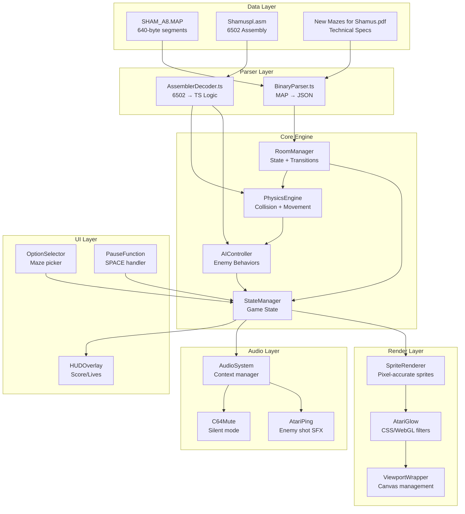
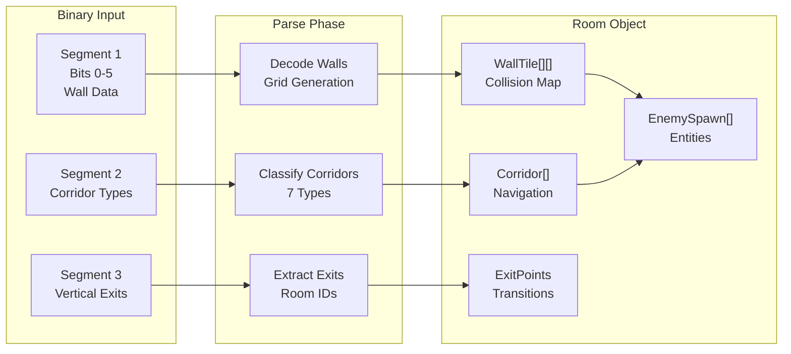
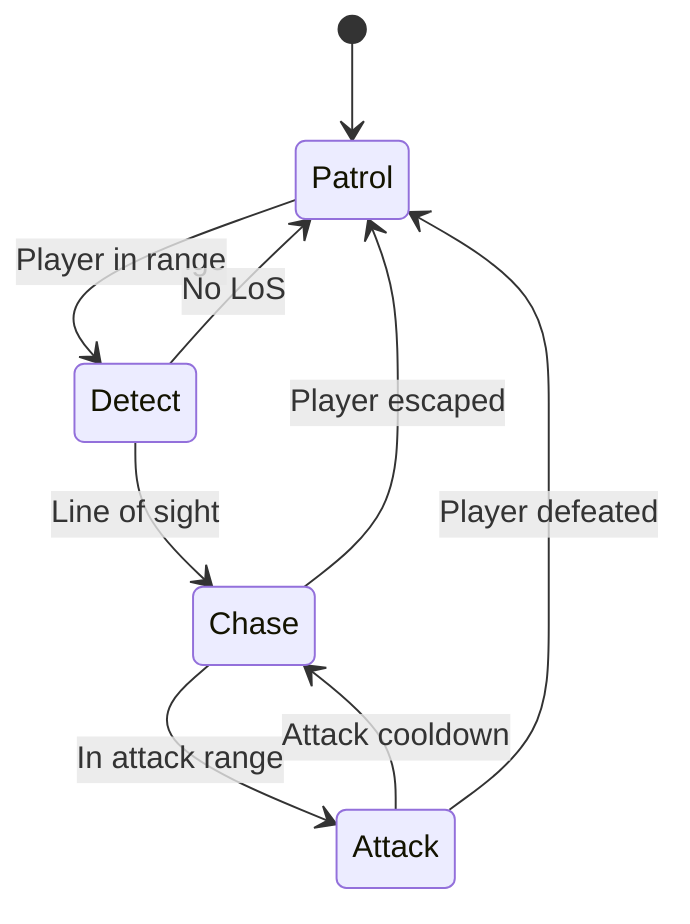
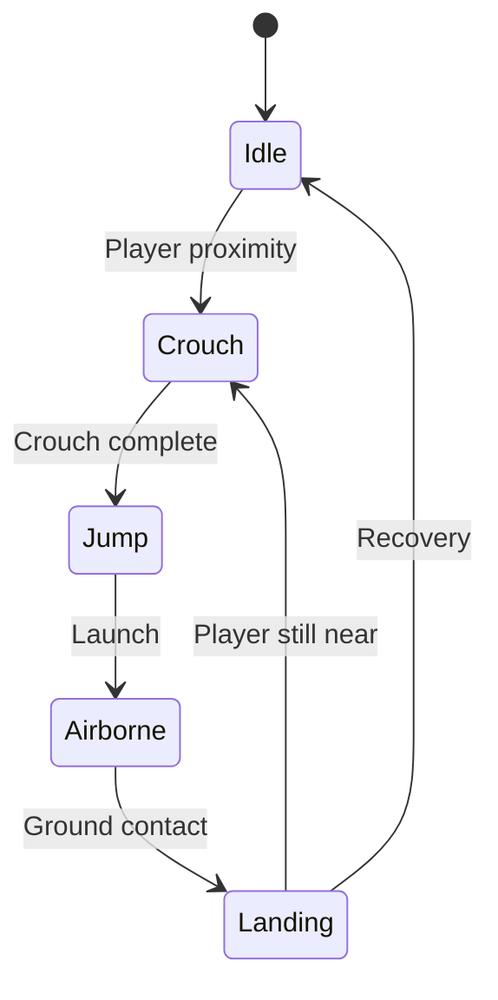
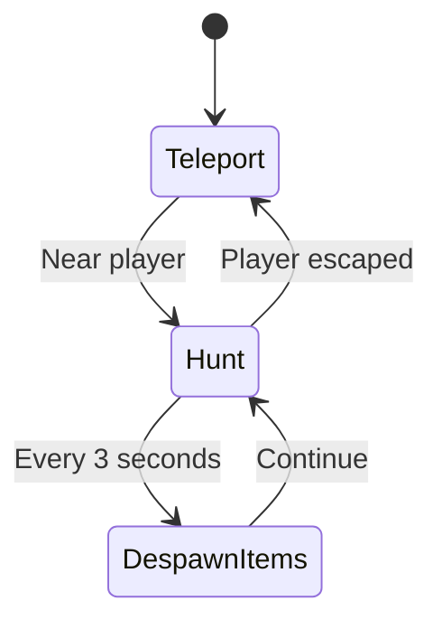
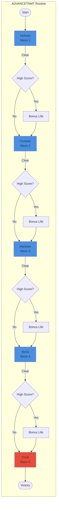
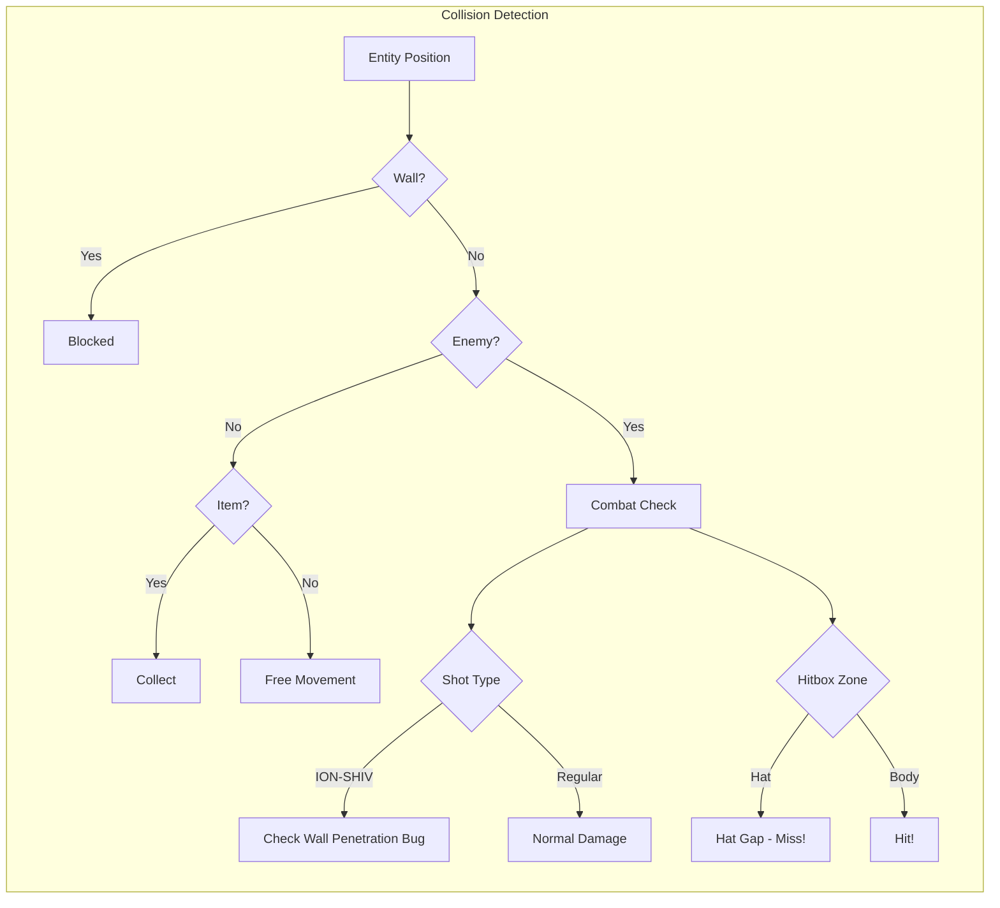
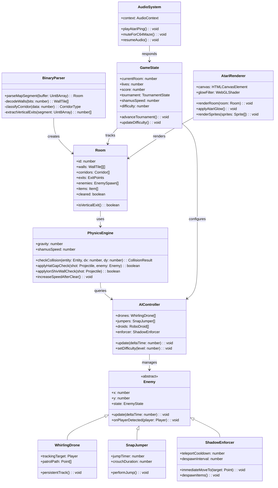

# Shamus+ System Architecture

## System Overview Diagram



---

## Room Data Flow



---

## AI Behavior State Machines

### Whirling Drone


### Snap Jumper


### Shadow Enforcer (Atari-style)


---

## Tournament Mode Sequence



---

## Collision System



---

## Class Hierarchy



---

## Memory Map Translation

| Atari Address | Modern Equivalent | Purpose |
|---------------|-------------------|---------|
| $0206 | `difficulty: number` | slx register - scaling difficulty |
| $02xx | `shamusSpeed: number` | Speed increase after room clear |
| $03xx | `currentRoom: number` | Active room ID |
| $04xx | `lives: number` | Player lives counter |
| $05xx | `score: number` | BCD score storage → JS number |
| SHAM_A8.MAP | `Room[]` | Binary → JSON rooms |
| ADVANCETNMT | `advanceTournament()` | Tournament progression routine |

---

## File Structure (Target)

```
shamus-plus-web/
├── public/
│   ├── assets/
│   │   ├── sprites/
│   │   │   ├── shamus-atari.png
│   │   │   ├── enemies.png
│   │   │   └── items.png
│   │   └── audio/
│   │       ├── atari-ping.wav
│   │       └── c64-silent-marker.json
│   └── index.html
├── src/
│   ├── index.ts
│   ├── parser/
│   │   ├── BinaryParser.ts
│   │   ├── MapLoader.ts
│   │   └── CorridorClassifier.ts
│   ├── engine/
│   │   ├── PhysicsEngine.ts
│   │   ├── CollisionSystem.ts
│   │   └── AIController.ts
│   ├── entities/
│   │   ├── Player.ts
│   │   ├── Enemy.ts
│   │   ├── WhirlingDrone.ts
│   │   ├── SnapJumper.ts
│   │   ├── RoboDroid.ts
│   │   └── ShadowEnforcer.ts
│   ├── state/
│   │   ├── GameState.ts
│   │   ├── TournamentMode.ts
│   │   └── RoomManager.ts
│   ├── render/
│   │   ├── AtariRenderer.ts
│   │   ├── SpriteSheet.ts
│   │   └── AtariGlow.ts
│   ├── audio/
│   │   ├── AudioSystem.ts
│   │   ├── AtariPing.ts
│   │   └── C64Mute.ts
│   ├── ui/
│   │   ├── OptionSelector.ts
│   │   ├── PauseFunction.ts
│   │   └── HUD.ts
│   └── types/
│       ├── index.ts
│       ├── Room.ts
│       ├── Enemy.ts
│       └── Game.ts
├── tests/
│   ├── parser.test.ts
│   ├── engine.test.ts
│   └── ai.test.ts
├── package.json
├── tsconfig.json
└── webpack.config.js
```
